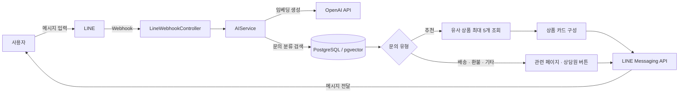
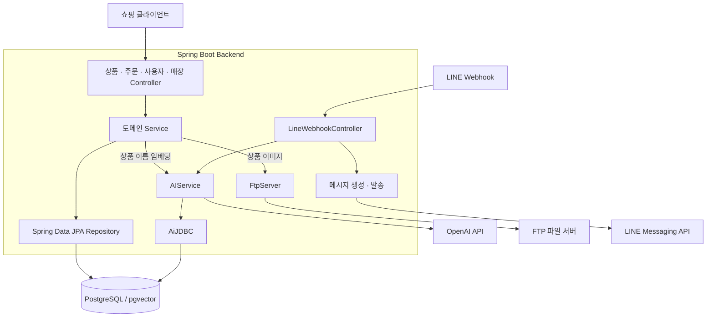

<h1 align="center">🛍️ Capstone BE</h1>

<p align="center">
  <b>LINE 대화로 찾는 상품, AI로 이어지는 쇼핑 경험</b><br/>
  LINE 메시지와 AI 상품 추천을 연결하는 쇼핑 서비스 백엔드입니다.
</p>

<p align="center">
  
  
  
  
</p>

<p align="center">
  <a href="#프로젝트-소개-">프로젝트 소개</a> ·
  <a href="#주요-기능-">주요 기능</a> ·
  <a href="#팀원-">팀원</a> ·
  <a href="#프로젝트-기술-스택-">기술 스택</a> ·
  <a href="#프로젝트-아키텍처-">아키텍처</a>
</p>

## 프로젝트 소개 📝

**Capstone BE**는 상품·주문 관리 API와 LINE 챗봇을 함께 제공하는 캡스톤 프로젝트입니다.

사용자가 LINE으로 메시지를 보내면, 서버는 메시지를 임베딩으로 변환하고 저장된 문의 분류와 비교합니다. 상품 추천 요청에는 유사한 상품을 찾아 이미지·가격·상세 페이지 링크가 담긴 카드를 전송하고, 배송·환불 문의에는 관련 페이지와 상담원 연결 버튼을 안내합니다.

쇼핑 서비스에서는 상품과 매장을 등록하고, 사용자·배송지·주문 정보를 관리할 수 있습니다. 상품 등록 시에는 상품 이름의 임베딩을 함께 저장해 이후 추천에 활용합니다.

## 주요 기능 ✨

| 기능 | 설명 |
| :--- | :--- |
| **AI 상품 추천** | 사용자 메시지와 상품 임베딩의 거리를 비교해 가까운 상품 최대 5개 조회 |
| **LINE 대화 연동** | 웹훅으로 메시지를 수신하고 텍스트·버튼·상품 카드 메시지 전송 |
| **문의 유형별 안내** | 추천·배송·환불 분류에 따라 상품 카드 또는 안내 버튼 제공 |
| **상품 관리** | 상품 등록·목록 및 단건 조회·수정·삭제 API, 브랜드·가격·판매 상태·할인 정보 관리 |
| **상품 이미지 업로드** | 선택적으로 첨부한 이미지를 FTP 서버에 비동기로 업로드하고 상품에 이미지 URL 저장 |
| **주문 관리** | 주문 생성·목록 및 단건 조회·수정·삭제 API |
| **사용자·배송지 관리** | 사용자 등록·조회·삭제 및 사용자별 배송지 등록·조회 |
| **매장 관리** | 매장 등록·조회 및 상품과 매장 연결 |

## 팀원 👥

이 백엔드 저장소의 커밋 기여자입니다.

| KimRPG | Kim-Min-Hyeok | SoominYoo |
| :---: | :---: | :---: |
|  |  |  |
| [@KimRPG](https://github.com/KimRPG) | [@Kim-Min-Hyeok](https://github.com/Kim-Min-Hyeok) | [@SoominYoo](https://github.com/SoominYoo) |

## 프로젝트 기술 스택 💡

### 백엔드

| 구분 | 기술 | 사용 목적 |
| :--- | :--- | :--- |
| Language | Java 17 | 서버 애플리케이션 개발 |
| Framework | Spring Boot 3.3.4, Spring Web | REST API 및 LINE 웹훅 처리 |
| Persistence | Spring Data JPA, JdbcTemplate | 도메인 데이터 저장·조회 및 벡터 검색 SQL 실행 |
| AI | Spring AI 1.0.0-M3, OpenAI 연동 | 텍스트 임베딩 생성 및 별도 AI 답변 API |
| Messaging | LINE Bot SDK 2.1.0, Reactor | LINE 메시지 수신·발송 및 비동기 응답 처리 |
| API Docs | springdoc-openapi 2.2.0 | OpenAPI 및 Swagger UI 설정 |
| Build | Gradle Wrapper 8.5 | 의존성 관리 및 빌드 |

### 데이터 및 외부 연동

| 구분 | 기술 | 사용 목적 |
| :--- | :--- | :--- |
| Database | PostgreSQL, pgvector | 쇼핑 데이터와 1,536차원 임베딩 저장, 벡터 거리 기반 검색 |
| File Storage | FTP, Apache Commons Net 3.9.0 | 상품 이미지 업로드 |
| Messaging Platform | LINE Messaging API | 사용자 대화 채널 및 상품 카드 전달 |
| AI Provider | OpenAI API | Spring AI를 통한 모델 호출 |

기술 및 버전은 [build.gradle](build.gradle)과 현재 소스 코드를 기준으로 정리했습니다. S3 설정·업로드 서비스도 남아 있지만, 현재 상품 등록 경로에서는 FTP를 사용합니다.

## 프로젝트 아키텍처 🏛️

### 사용자 요청 흐름



### 백엔드 구성



위 다이어그램은 코드의 호출 관계를 나타냅니다. 배포 서버 구성이나 CI/CD 파이프라인은 이 저장소에 정의되어 있지 않습니다.

### AI 추천 방식

1. **상품 등록** — 상품 이름을 임베딩으로 변환해 `product.embedding`에 저장합니다.
2. **문의 분류** — 사용자 메시지의 임베딩과 `recommend` 테이블을 비교해 가장 가까운 분류 하나를 선택합니다.
3. **상품 검색** — 분류가 `추천`이면 같은 메시지 임베딩으로 상품을 검색합니다. pgvector의 `<->` 거리 연산 결과를 오름차순으로 정렬하고 최대 5개를 가져옵니다.
4. **카드 전송** — 조회한 상품을 이미지·이름·설명·가격·상세 링크가 있는 LINE 상품 카드로 변환해 전송합니다.

구현: [AIService](src/main/java/com/capstonexjapan/line_backend/ai/service/AIService.java) · [AiJDBC](src/main/java/com/capstonexjapan/line_backend/ai/repo/AiJDBC.java) · [LineWebhookController](src/main/java/com/capstonexjapan/line_backend/line_message/controller/LineWebhookController.java)

## 주요 API 🔌

| 영역 | Method | Path | 기능 |
| :--- | :--- | :--- | :--- |
| 상품 | `POST` · `GET` · `PATCH` · `DELETE` | `/product` | 상품 등록·조회·수정·삭제 |
| 주문 | `POST` · `GET` · `PATCH` · `DELETE` | `/order` | 주문 생성·조회·수정·삭제 |
| 사용자 | `POST` · `GET` · `DELETE` | `/user` | 사용자 등록·조회·삭제 |
| 배송지 | `POST` · `GET` | `/user/address` | 사용자별 배송지 등록·조회 |
| 매장 | `POST` · `GET` | `/store` | 매장 등록·조회 |
| AI | `GET` | `/ai/answer` | AI 텍스트 답변 |
| AI | `GET` | `/ai/recommend` | 문의 유형 분류 |
| AI | `GET` | `/ai/recommend/product` | 유사 상품 추천 |
| LINE | `POST` | `/channel/line` | 웹훅 이벤트 수신 |
| LINE | `POST` | `/channel/line/text` | 텍스트 메시지 전송 |
| LINE | `POST` | `/channel/line/question` | 버튼을 포함한 메시지 전송 |
| LINE | `POST` | `/channel/line/product-card` | 상품 카드 메시지 전송 |

상품·주문·사용자·매장 조회는 `id` 쿼리 파라미터 유무에 따라 단건 또는 목록을 반환합니다. 배송지는 등록 시 `userId`, 조회 시 `id`로 사용자 ID를 전달합니다. 현재 AI 조회 API는 `GET` 요청의 JSON 본문으로 `{"request":"메시지"}`를 받습니다.

## 프로젝트 구조 📂

```text
src/main/java/com/capstonexjapan/line_backend
├── ai                  # 임베딩 생성, 문의 분류, 상품 추천
├── config              # AI, LINE, CORS, S3, OpenAPI 설정
├── ftp                 # FTP 업로드 및 파일 변환
├── global/exception    # 공통 예외 처리
├── line_message        # LINE 웹훅, 메시지 생성 및 발송
└── shop
    ├── product         # 상품 및 이미지 관리
    ├── order           # 주문 및 주문 이력 관련 코드
    ├── user            # 사용자 및 배송지 관리
    ├── store           # 매장 관리
    └── square          # 결제 연동용 기본 구조
```

## 개발 환경 준비 ⚙️

실행에는 **JDK 17**, **pgvector를 사용할 수 있는 PostgreSQL**, **OpenAI 및 LINE 연결 정보**, **FTP 서버 설정**이 필요합니다. 로컬 설정 파일(`*.yml`, `*.properties`)은 Git 관리 대상에서 제외되어 있습니다.

| 설정 영역 | 준비할 항목 |
| :--- | :--- |
| 데이터베이스 | Spring datasource 연결 정보, `vector` 확장 및 임베딩 컬럼 구성 |
| AI | Spring AI OpenAI 인증·모델 설정, 저장된 임베딩과 동일한 모델 및 1,536차원 출력 |
| 문의 분류 | `recommend` 테이블에 문의 유형과 해당 임베딩 사전 저장 |
| LINE | `line.channel.token`, 공개 웹훅 주소 `/channel/line` |
| FTP | `ftp.server`, `ftp.username`, `ftp.password` 및 업로드 디렉터리 `/A` |
| 잔존 S3 설정 | `cloud.aws.credentials.access-key`, `cloud.aws.credentials.secret-key`, `cloud.aws.region.static`, `cloud.aws.s3.bucket` |

<details>
<summary>현재 코드 기준 실행 전 확인 사항</summary>

- LINE 클라이언트 설정의 `@Value(".${line.channel.token}")`에는 토큰 앞에 마침표가 붙습니다. 실제 연동 전 토큰 주입식을 확인해야 합니다.
- CORS 허용 주소, 상품 상세·배송·주문 페이지 링크와 이미지 기본 URL은 시연 환경 값이 코드에 지정되어 있어 실행 환경에 맞게 조정해야 합니다.
- S3는 현재 상품 업로드 경로에서 사용하지 않지만 설정 빈이 남아 있으므로 관련 설정을 제공하거나 빈 구성을 정리해야 합니다.
- 문의 분류 데이터의 자동 초기화 절차는 포함되어 있지 않으며, `/ai/embedding` 매핑도 주석 처리되어 있습니다.
- `shop/square`의 결제 클래스는 기본 구조만 남아 있습니다. 주문 이력 저장 서비스도 현재 주문 생성 흐름에서는 호출되지 않습니다.

이 문서는 소스 코드를 기준으로 작성했으며, 외부 서비스 연결을 포함한 실행 검증 결과를 의미하지 않습니다.

</details>
